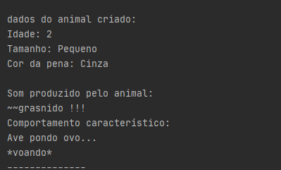

Executando programa.

1.Digite uma das opções.  
</img>  
2.Dê dados sobre o animal ser criado  
</img>  
3.O programa dará os dados do animal criado, e entao
retornará para o passo 1, até que seja digitado 5.  
</img>
